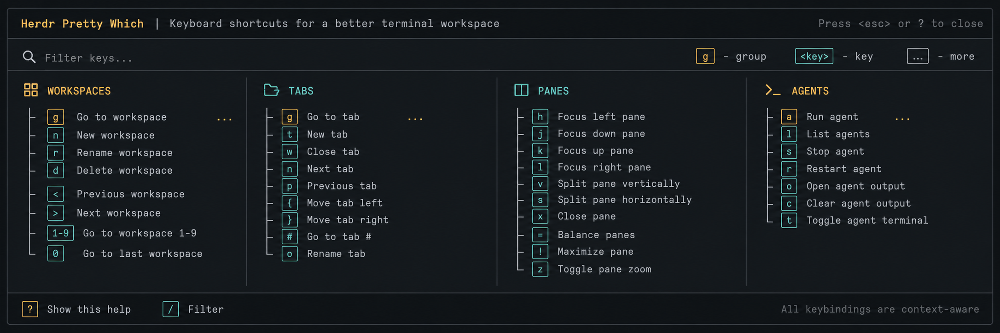

# Herdr Pretty Which

[](https://crates.io/crates/herdr-pretty-which)
[](https://docs.rs/herdr-pretty-which)
[](https://github.com/ramarivera/herdr-pretty-which/actions/workflows/ci.yml)
[](LICENSE)



A which-key style training overlay for [Herdr](https://herdr.dev), built as a Rust/Ratatui plugin.

It reads your real Herdr config, merges it with known defaults, and renders a searchable keybinding guide with list/tree modes, assigned/unassigned filtering, and contrast-safe selection styling. It does **not** invent bindings; values are marked as default, config, or unset based on the loaded config.

## Install

Plugin linking requires Herdr's plugin-capable line (`herdr >= 0.7.0`). If `herdr --version` reports an older version, use the snapshot command for now or upgrade Herdr before running `herdr plugin ...` commands.

```nu
cargo install herdr-pretty-which --locked
herdr plugin link cargo
herdr plugin pane open --plugin ramarivera.pretty-which --entrypoint overlay --placement overlay --focus
```

You can also install the GitHub-managed plugin checkout directly. Herdr will
build the release binary during install and run it from the managed checkout:

```nu
herdr plugin install ramarivera/herdr-pretty-which
```

## Local development

Use the checkout path only when developing the plugin itself:

```nu
cargo install --path . --locked
herdr plugin link .
herdr plugin pane open --plugin ramarivera.pretty-which --entrypoint overlay --placement overlay --focus
```

## Keybinding

Bind the plugin action through Herdr's command keybinding support:

```toml
[[keys.command]]
name = "Pretty Which"
description = "open pretty which"
key = "prefix+space"
type = "plugin_action"
command = "ramarivera.pretty-which.open"
```

## Controls

- `↑/↓`: move selection
- type: fuzzy filter
- `Backspace`: edit filter
- `Tab` / `Shift+Tab`: cycle `ALL` / `ASSIGNED` / `UNASSIGNED`
- `Ctrl+T`: toggle `LIST` / `TREE`
- `←/→`: collapse/expand or move through tree groups
- `Ctrl+[` / `Ctrl+]`: collapse/expand all tree groups
- `Esc` / `q`: close

## Testing

```nu
cargo test
cargo test --test render_snapshots
cargo test --test cli_e2e
```

Optional live Herdr smoke test, only when you explicitly want the socket/plugin loop:

```nu
$env.HERDR_LIVE_E2E = "1"
cargo test --test live_herdr_e2e -- --ignored
```

The live test links the local plugin and verifies Herdr can see/invoke it. It does not stop your server or delete sessions.
